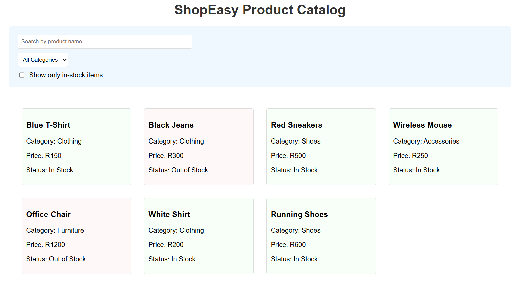
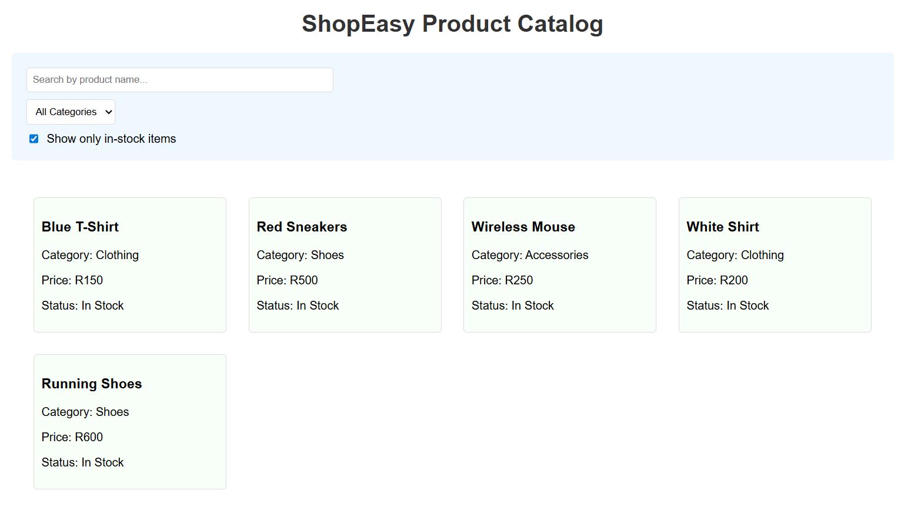
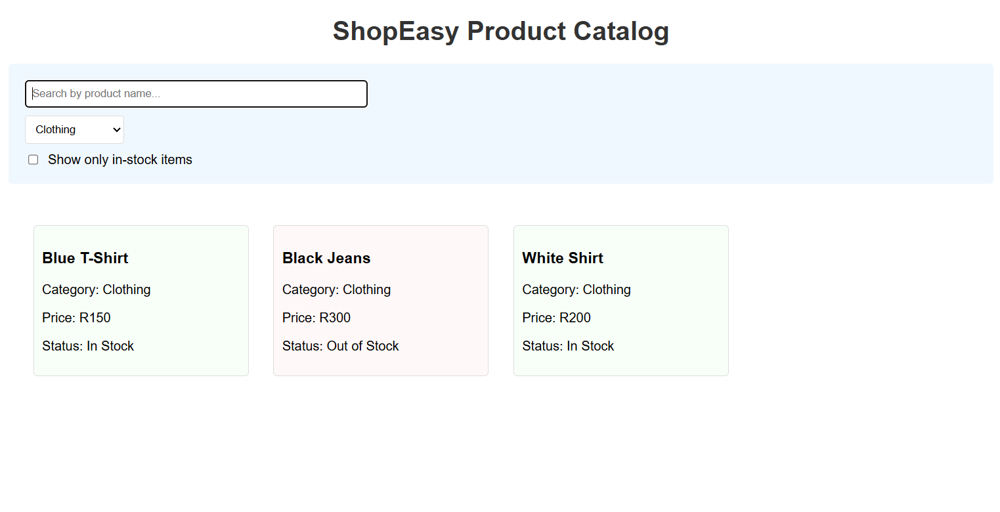

# Product Filter App (GradedLab 01)

## Description

This is a first gradedLab React application that displays a list of products and allows filtering by name, category, and stock availability using React functional components, hooks, and conditional rendering as requested on questions.

## How to Run

1. **Move inside the project root:**
   ```bash
   cd product-filtering
   ```

2. **Install dependencies:**
   ```bash
   npm install
   ```

3. **Start the development server:**
   ```bash
   npm run dev
   ```

4. **Open in browser:**
   ```
   http://localhost:5173
   ```

## Contents

1. App UI
   

2. Filtering by in stock while checked
   

3. Filtering by drop-down category selection
   

## Features

- Product list display
- Filter by product name
- Filter by category
- Filter by stock availability
- Built with React functional components and hooks
- Conditional rendering for dynamic UI updates